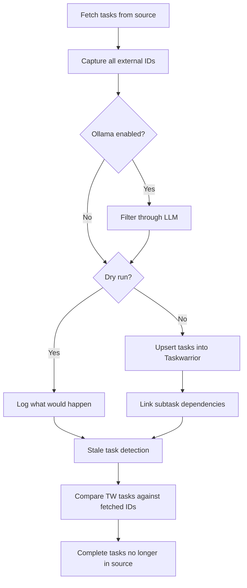
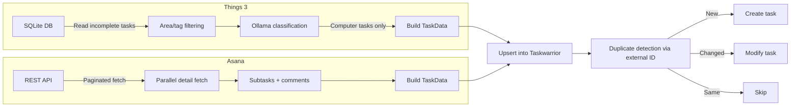
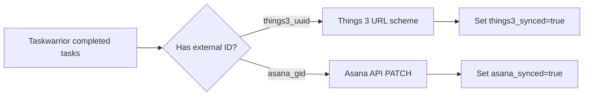
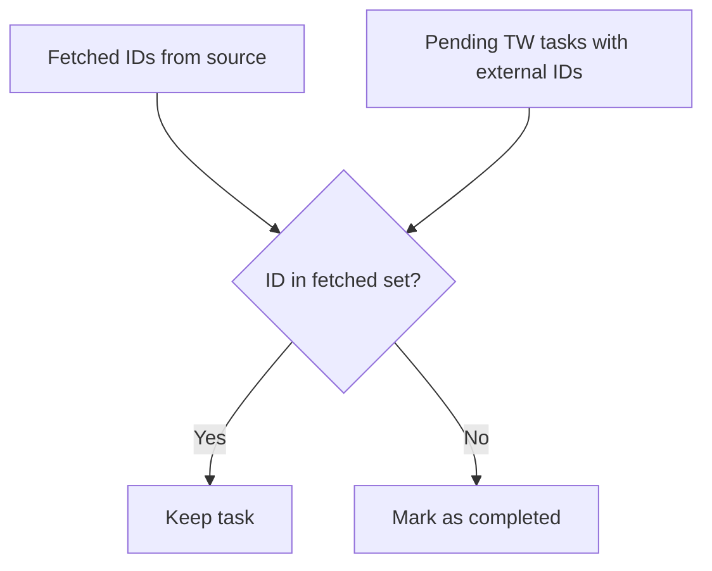

# todo-sync

Bidirectional task sync between **Things 3**, **Asana**, and **Taskwarrior**.

Pulls incomplete tasks from Things 3 and Asana into Taskwarrior, optionally filters Things 3 tasks through a local LLM, detects stale tasks, and pushes completions back to both sources.

## Architecture

```
┌─────────────┐         ┌──────────────────┐         ┌─────────────┐
│  Things 3   │────────▶│                  │────────▶│  Things 3   │
│  (SQLite)   │  pull   │                  │  push   │  (URL scheme)│
└─────────────┘         │                  │         └─────────────┘
       │                │   Taskwarrior    │                ▲
       ▼                │   (task store)   │                │
 ┌───────────┐          │                  │          ┌─────────────┐
 │  Ollama   │─filter──▶│                  │──push───▶│   Asana     │
 │  (LLM)    │          │                  │          │   (API)     │
 └───────────┘          └──────────────────┘          └─────────────┘
                                ▲
                                │ pull
                         ┌──────────────┐
                         │    Asana     │
                         │    (API)     │
                         └──────────────┘
```

### Sync Flow



### Pull: Source → Taskwarrior



### Push: Taskwarrior → Sources



### Stale Task Detection

When a task is completed or deleted in a source (Asana or Things 3), its Taskwarrior copy would otherwise stay pending forever. The sync detects these orphans:



External IDs are captured **before** Ollama filtering, so tasks excluded by the LLM aren't falsely marked as stale. If the fetch itself fails, stale detection is skipped entirely.

## Installation

```bash
cd ts
npm install
npm run build
npm link  # makes `todo-sync-ts` available globally
```

### Prerequisites

- **Node.js** >= 18
- **Taskwarrior** (`task`) installed and on PATH
- **Things 3** (macOS) — for Things sync
- **Ollama** (optional) — for LLM task filtering

## Setup

```bash
todo-sync-ts setup
```

This will:
1. Create Taskwarrior UDA fields needed for sync
2. Prompt for your Asana Personal Access Token
3. Generate a config file at `~/.config/todo-sync/config.toml`

## Configuration

**`~/.config/todo-sync/config.toml`**

```toml
[asana]
personal_access_token = "1/12345..."
# workspace = ""  # auto-detected if you have one workspace

[things]
enabled = true
auth_token = ""          # Things URL scheme auth token (for push-back)
# areas = ["Work"]       # filter to specific areas; empty = all

[sync]
things_tag = "things3"   # tag added to all Things imports
asana_tag = "asana"      # tag added to all Asana imports

[ollama]
enabled = true
model = "lfm2.5-thinking"
# base_url = "http://localhost:11434"
```

## CLI Commands

| Command | Description |
|---------|-------------|
| `setup` | Interactive first-time setup |
| `things` | Pull tasks from Things 3 (with Ollama filtering) |
| `asana` | Pull tasks from Asana |
| `all` | Pull from both sources |
| `push` | Push completions back to Things 3 and Asana |
| `push-things` | Push completions to Things 3 only |
| `push-asana` | Push completions to Asana only |
| `sync` | Full round-trip: pull from both, push completions back |
| `install-hook` | Install Taskwarrior on-exit hook for auto sync (Things 3 + Asana) |
| `uninstall-hook` | Remove the Taskwarrior hook |

All commands support `--dry-run` to preview changes without making them:

```bash
todo-sync-ts --dry-run sync
```

## Taskwarrior UDAs

The sync uses custom UDA fields in Taskwarrior for tracking:

| Field | Purpose |
|-------|---------|
| `things3_uuid` | External ID from Things 3 |
| `asana_gid` | External ID from Asana |
| `source` | Origin: `"things3"` or `"asana"` |
| `things3_synced` | `"true"` if completion pushed back to Things |
| `asana_synced` | `"true"` if completion pushed back to Asana |
| `asana_parent_gid` | Parent task GID for Asana subtasks |

## Ollama Filtering

Things 3 tasks are classified by a local LLM to import only computer/developer work into Taskwarrior. Tasks like "Buy groceries" or "Dentist appointment" are excluded.

**Included:** coding, debugging, code review, writing docs, system admin, deployments, digital design, technical research.

**Excluded:** shopping, chores, appointments, exercise, errands, social events.

The filter uses temperature `0.0` for deterministic results. If Ollama is unreachable, all tasks are imported as a fallback.

## Automation

A launchd plist runs a full `sync` every 30 minutes:

```bash
# Install
cp launchd/com.todo-sync.plist ~/Library/LaunchAgents/
launchctl load ~/Library/LaunchAgents/com.todo-sync.plist

# Check logs
tail -f /tmp/todo-sync.log
```

### Taskwarrior Hook

The on-exit hook provides real-time sync — completing a task in Taskwarrior immediately marks it complete in the source (Things 3 and/or Asana):

```bash
todo-sync-ts install-hook    # symlinks to ~/.task/hooks/
todo-sync-ts uninstall-hook  # removes symlink
```

## Project Structure

```
todo-system/
├── launchd/
│   └── com.todo-sync.plist          # macOS scheduled sync
└── ts/
    ├── package.json
    ├── tsconfig.json
    ├── hooks/
    │   └── on-exit-sync              # TW hook (bash wrapper)
    └── src/
        ├── cli.ts                   # CLI entry point
        ├── config.ts                # TOML config management
        ├── types.ts                 # Shared types
        ├── taskwarrior.ts           # TW integration & UDAs
        ├── things-reader.ts         # Things 3 SQLite reader
        ├── things-writer.ts         # Things 3 URL scheme writer
        ├── asana-reader.ts          # Asana API reader
        ├── asana-writer.ts          # Asana API writer
        ├── ollama-filter.ts         # LLM task classifier
        ├── hook-on-exit.ts          # TW hook implementation
        ├── taskwarrior.test.ts      # Tests
        ├── things-reader.test.ts    # Tests
        └── ollama-filter.test.ts    # Tests
```

## Development

```bash
cd ts
npm run dev -- sync          # run without building (via tsx)
npm run build                # compile TypeScript
npm test                     # run tests once
npm run test:watch           # run tests in watch mode
```

## Dependencies

| Package | Purpose |
|---------|---------|
| `commander` | CLI framework |
| `better-sqlite3` | Read Things 3 SQLite database |
| `asana` | Official Asana Node.js SDK |
| `smol-toml` | TOML config parsing |
